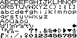
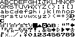
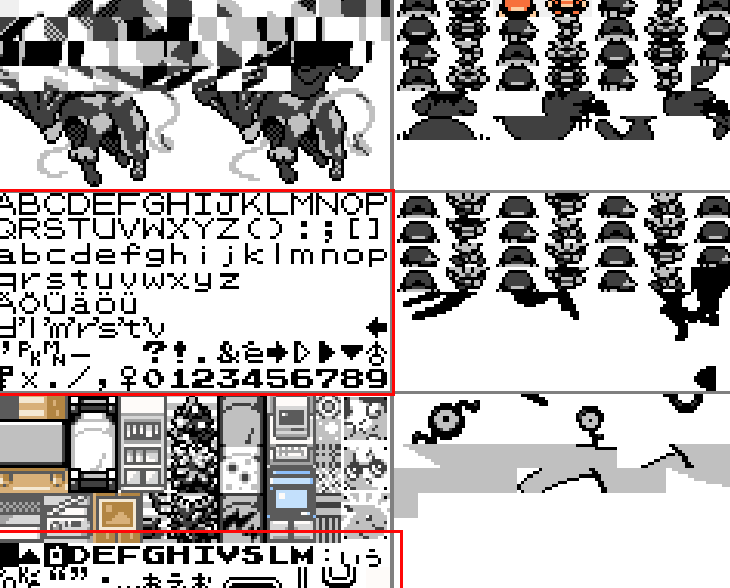
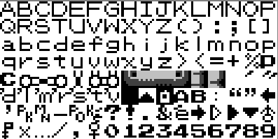
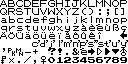

# Table des caractères français

&nbsp&nbsp&nbsp Quand j'ai commencé à faire la traduction, je n'avais aucune connaissance de comment fonctionnait le code du jeu. Je pensais initialement que je pouvais simplement déplacer le code de la [décompilation française](https://github.com/qwilvove/pokecrystal-fr) vers la Rom Hack, et que tout allait fonctionner… Spoiler : Oui, ça a curieusement fonctionné mais j'avais globalement cassé l'affichage de beaucoup d'éléments.

J'ai donc repris de 0 et je me suis penché plus en détail sur le mapping des caractères.

Le problème pour changer le charmap de l'anglais au français est que [cRz-Shadows](https://github.com/cRz-Shadows) a retravaillé la manière dont le jeu charge les tiles, dans le but d'ajouter le "[Pokédex de Nayru](https://github.com/Nayru62/pokecrystal/tree/Nayrus-Pokedex-Vanilla-TypeGFX-BETA)" qui a besoin d'un tileset étendu (voir commit [32efdb2](https://github.com/cRz-Shadows/Pokemon_Crystal_Legacy/commit/32efdb2ad7acc457ae552278e28ffd3fb0a9d400)).

Globalement, ça signifie que il y a une différence non négligeable de comment le jeu affiche les caractères par rapport à la version originale :

    
    

La première photo correspond au `font.png` original utilisé dans la version anglaise, à droite celui utilisé dans la Rom Hack. De plus, il existe également un fichier `font_extra.png` que je n'affiche pas ici mais qui contient des caractères supplémentaires. 

La première chose à observer c'est que tout a été compacté. 
Les caractères non présents dans le fichier de gauche mais présents à droite proviennent justement de `font_extra.png`, le but étant de tout réunir au même endroit afin d'économiser le maximum d'espace disponible dans la VRAM du jeu, les emplacements graphiques qui servent à afficher les éléments.

La Gameboy Color dispose de 6 emplacements de 8x16 de ce que j'ai pu observé. 
Voici un exemple du contenu chargé de la VRAM dans l'overworld du jeu Crystal original (anglais) :

    

    
    

Ci-dessus, `font.png` présent dans les fichiers ainsi que le même, une fois chargé en jeu.
Comme on peut le voir, les quelques emplacements libres (cases blanches) se voient être occupés en jeu par l'encadrement de la dialogue box, et par le panneau d'indication de changement de location.

    

Ci-dessous la liste des caractères que l'on retrouve dans le fichier `gfx/font/french_german.png`.

✅ = Utilisé dans le code
❌ = Non utilisé

| à   | è   | ù   | ß   | ç   |     |     |     |     |     |     |     |     |
| --- | --- | --- | --- | --- | --- | --- | --- | --- | --- | --- | --- | --- |
| ✅   | ✅   | ✅   | ❌   | ✅   |     |     |     |     |     |     |     |     |
| Ä   | Ö   | Ü   | ä   | ö   | ü   | ë   | ï   | â   | ô   | û   | ê   | î   |
| ❌   | ❌   | ❌   | ❌   | ❌   | ❌   | ❌   | ✅   | ✅   | ✅   | ✅   | ✅   | ✅   |
| c'  | d'  | j'  | l'  | m'  | n'  | p'  | s'  | 's  | t'  | u'  | y'  |     |
| ✅   | ✅   | ✅   | ✅   | ✅   | ✅   | ✅   | ✅   | ✅   | ✅   | ✅   | ✅   |     |

> [!NOTE] 
> Bien que `'s` puisse évoquer le possessif en anglais, il est en réalité utilisé dans les contractions telles que : "J'suis". 
> 
> J'ai cependant décidé de le retirer pour libérer une place, l'apostrophe normale sera utilisée à la place.

Comme on peut le voir, malgré 8 caractères retirés, c'est difficile de pouvoir inclure tous les accents nécessaires pour le français. 